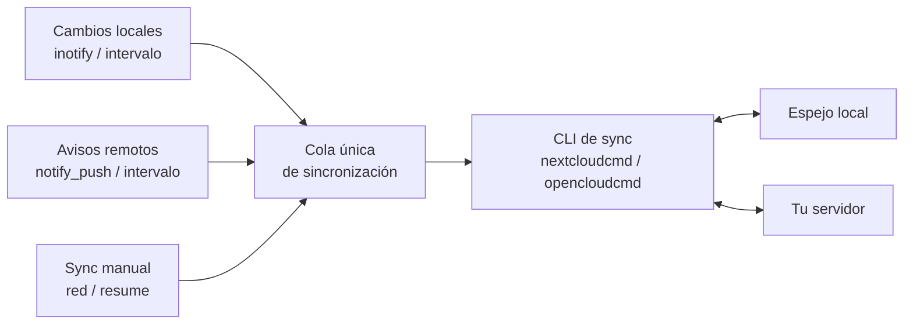

<div align="center">
  <h1>NextSync</h1>
  <p><strong>Tus ficheros, en local. Cualquier servidor, en sincronización.</strong></p>
  <p>Un compañero de escritorio para GNOME que mantiene espejos locales completos de tus cuentas. Agnóstico del servidor, construido con Rust, GTK 4 y Libadwaita.</p>
  <p>
    <a href="https://nextsync.cloudless.club/">Sitio web</a>
    ·
    <a href="https://github.com/gnacho/nextsync/issues">Reportar un problema</a>
  </p>
  <p align="center">
    <a href="README.es.md">Español</a> |
    <a href="README.md">English</a>
  </p>
  <p>
    
    <a href="https://nextsync.cloudless.club/"></a>
    
    
    
    
    
  </p>
</div>

## Un compañero de GNOME al que no le importa qué servidor uses

NextSync es una aplicación de escritorio GNOME que mantiene una o varias cuentas reflejadas en una o varias carpetas locales. Es **agnóstico del servidor por diseño**: no habla el protocolo de ningún proveedor, delega la sincronización en sí misma en una herramienta de sincronización por línea de comandos, y construye la experiencia de escritorio alrededor de esa herramienta.

Hoy eso significa dos proveedores:

- **Nextcloud**, a través del motor oficial `nextcloudcmd`.
- **OpenCloud**, a través del motor oficial `opencloudcmd`.

Cualquier plataforma que publique un CLI de sincronización puede añadirse después detrás de la misma abstracción. La capa de escritorio (cuentas, credenciales, programación, monitorización del sistema de ficheros, bandeja, ventanas, registros, resolución de conflictos) permanece igual; solo cambia el constructor del comando.

El motor es la parte que hace el trabajo importante. NextSync es la parte que lo hace vivir bien en el escritorio: inicio de sesión seguro, disparadores automáticos, una ventana de estado compacta, integración con GNOME, registros y un menú de bandeja.

### Un fork, con agradecimiento

NextSync hereda su identidad y gran parte de su diseño de [**PyNextCloud-Sync**](https://github.com/ehstbr/PyNextCloud-Sync), de **ehstbr**. Ese proyecto es una pieza de trabajo preciosa, y todas las buenas decisiones que tomó sobre la experiencia de escritorio se han mantenido aquí.

Nosotros tomamos una dirección distinta por debajo. PyNextCloud-Sync envuelve un motor de Nextcloud en Python y GTK 4 vía PyGObject. NextSync es una reescritura en Rust que generaliza la idea: en lugar de un compañero para una cuenta de Nextcloud concreta, es un compañero para **cualquier herramienta de sincronización** que publique tu servidor.

Muchas gracias a ehstbr por iniciar algo tan maravilloso, por tomar las decisiones acertadas que hemos heredado, y por publicarlo bajo la licencia GPL-3.0-or-later, que hace posible este proyecto.

## Por qué una reescritura en Rust

- **Un único binario estático.** Sin runtime de Python, sin estructura de site-packages. La distribución y el autostart son triviales.
- **Huella pequeña en reposo.** Un compañero de bandeja y ventanas se sitúa muy por debajo de la línea base del intérprete de Python, y el arranque es casi inmediato.
- **Seguridad de tipos en toda la app.** Los tiempos de vida de GObject, los callbacks asíncronos y la máquina de estados son exactamente donde más ayuda Rust.
- **Agnóstico del servidor por construcción.** El motor de sincronización está detrás de un trait pequeño, así que añadir un tercer proveedor es un constructor de comando, no un cambio de arquitectura.

## Características destacadas

- **Multicuenta.** Cada cuenta mantiene sus propios ajustes de sincronización y de runtime.
- **Multicarpeta.** Cada cuenta puede reflejar varias carpetas locales, cada una con su ruta remota (o espacio de OpenCloud), su propio estado y sus propios disparadores.
- **Multiproveedor.** Nextcloud y OpenCloud hoy, cualquier cosa con un CLI de sincronización mañana, todo en una sola app.
- **Pensado para cuentas grandes.** Sin copias de staging, sin análisis previo a la transferencia. La detección delta del motor descarga solo lo que difiere.
- **Recursos optimizados, no duplicados.** Todos los disparadores desembocan en una única cola de coalescencia por cuenta, y la app nunca lanza dos procesos de sincronización para la misma carpeta. Un cambio remoto y un cambio local que llegan juntos producen una ejecución, no dos.
- **Motor oficial.** La herramienta CLI es dueña de la sincronización, la resolución de conflictos y la seguridad. NextSync añade la experiencia de escritorio y los huecos que el CLI deja abiertos.
- **Interfaz nativa de GNOME.** Rust, GTK 4 y Libadwaita.
- **Credenciales seguras.** Almacenadas a través de Secret Service / GNOME Keyring.
- **Detección local rápida.** Monitorización recursiva de `inotify` en Linux con coalescencia de eventos.
- **Menú de bandeja.** Abrir, Configuración, Registro y Salir directamente desde la bandeja; cerrar la ventana mantiene la app funcionando en segundo plano (el item Salir de la bandeja es la única forma de salir del todo).
- **Guardia de borrado.** Un borrado masivo local bloquea la sincronización antes de que el motor pueda propagarlo, porque los motores CLI no piden confirmación en modo no interactivo.
- **Privado por diseño.** Sin telemetría, sin analítica, sin informes remotos de fallos.

## Cómo funciona la sincronización

Cada disparador pide al mismo programador una reconciliación bidireccional. Las peticiones que llegan juntas se coalescen en una única cola, y la app nunca inicia dos procesos del motor para la misma cuenta.



> [!IMPORTANT]
> La sincronización es bidireccional. Los cambios locales y remotos, incluidos los borrados, pueden propagarse al otro lado. Mantén una copia de seguridad independiente de los datos importantes y no ejecutes otro motor de sincronización contra la misma carpeta local.

## Proveedores

| Proveedor | Motor | Autenticación |
|---|---|---|
| Nextcloud | `nextcloudcmd` | Login Flow v2 (navegador) o credenciales vía Secret Service |
| OpenCloud | `opencloudcmd` | Contraseña de aplicación creada en la web del servidor, guardada en Secret Service |

Las notificaciones push vía `notify_push` aplican a Nextcloud. OpenCloud no tiene `notify_push`, por lo que esa cuenta se apoya en el disparador de intervalo remoto.

## Estado del proyecto

Esta es una versión de desarrollo temprana. La arquitectura está en su sitio: configuración, credenciales, máquina de estados, programador, motor de sincronización con progreso en vivo, monitorización del sistema de ficheros, guardia de borrado y la abstracción de proveedores. La interfaz GTK es lo siguiente que se está construyendo.

Pruébalo con datos no críticos antes de confiar en él para la sincronización habitual, y mantén siempre copias de seguridad independientes de los ficheros importantes.

## Desarrollo y tests

```bash
cargo check
cargo test
cargo clippy --all-targets -- -D warnings
```

La suite cubre configuración, credenciales, la máquina de estados, el programador, los constructores de comando de sincronización para ambos proveedores, el analizador de progreso en vivo, la monitorización del sistema de ficheros, la guardia de borrado y el protocolo notify_push incluyendo un handshake WebSocket tolerante.

Los tests con cuenta real requieren un servidor real y una sesión de escritorio, y están marcados con `#[ignore]`.

## Documentación

- [Plan de implementación](plans/2026-08-13-rust-rewrite.md)
- [Licencia pública general GNU v3 o posterior](LICENSE)

---

<p align="center"><sub>
Nextcloud es una marca registrada de Nextcloud GmbH. OpenCloud es un producto del grupo Heinlein. NextSync es un proyecto independiente y no oficial, y no está afiliado, patrocinado, respaldado ni conectado de ningún otro modo con ninguna de las dos empresas. El uso está sujeto a la Licencia Pública General GNU versión 3 o posterior.
</sub></p>
