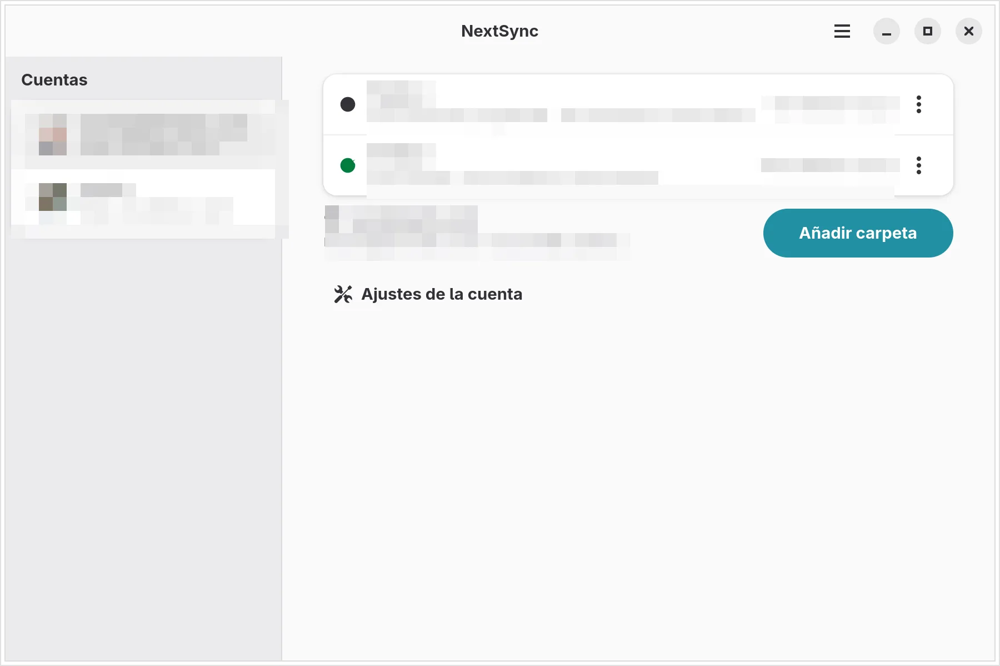

<div align="center">
  
  <h1>NextSync</h1>
  <p><strong>Tus archivos, en local.<br>Cualquier servidor, en sincronía.</strong></p>
  <p>Un cliente de escritorio para GNOME que mantiene un espejo local completo de tus cuentas Nextcloud y OpenCloud.<br>Un único binario Rust. Sin telemetría, sin suscripciones.</p>
  <p>
    <a href="https://nextsync.cloudless.club/">Web</a>
    ·
    <a href="https://github.com/gnacho/nextsync/releases">Releases</a>
    ·
    <a href="https://github.com/gnacho/nextsync/issues">Incidencias</a>
  </p>
  <p>
    <a href="README.md">English</a>
    ·
    <a href="README.es.md">Español</a>
  </p>
  <p>
    <a href="https://github.com/gnacho/nextsync/actions/workflows/ci.yml"></a>
    
    
  </p>
</div>

<p align="center">
  <picture>
    <source media="(prefers-color-scheme: dark)" srcset="landing/assets/shots/main-es-dark.webp">
    
  </picture>
</p>

## Qué es

Tus archivos viven en tu disco. Cuando tu ordenador y tu servidor tienen que ponerse de acuerdo sobre qué ha cambiado, NextSync llama al motor oficial de línea de comandos de tu plataforma y lo envuelve en una experiencia de escritorio de verdad: cuentas, configuración por carpeta, progreso en vivo, resolución de conflictos y un icono de bandeja que refleja lo que de verdad está pasando.

Es ingeniería aburrida a propósito. La lógica de reconciliación se queda en los motores oficiales, que arrastran años de casos límite. Todo lo que NextSync añade es pegamento de escritorio: cuándo ejecutar, qué mostrar y qué hacer cuando algo falla.

## Por qué existe

Empecé con un fork en Python de PyNextCloud-Sync, una pequeña app de GNOME de ehstbr que ya había entendido la idea correcta: no inventar otro algoritmo de sincronización, envolver el motor oficial y hacer que vivir con él sea agradable. Usé esa app, aprendí de ella y compartía la mayoría de sus decisiones.

La reescritura en Rust llegó por razones prácticas: quería varias cuentas y varios proveedores en una sola app, un único binario sin runtime de Python y un código donde los callbacks asíncronos y los lifetimes de GObject no pudieran morderme en tiempo de ejecución. La filosofía del envoltorio siguió intacta, la capa de escritorio se reconstruyó y el proyecto creció hasta tener vida propia. Gracias, ehstbr, por publicar el original bajo GPL-3.0-or-later y hacer posible todo esto.

## Qué hace

**Sincronización**

- Varias cuentas y varias carpetas por cuenta, cada una mapeada a su ruta remota o su espacio de OpenCloud.
- Reconciliación bidireccional con los motores oficiales, con transferencias delta y copias en conflicto.
- Un sondeo remoto que comprueba primero el ETag de la carpeta y se salta el escaneo si el servidor no ha cambiado. El ETag sobrevive a los reinicios.
- Un planificador que agrupa los disparadores en una única cola, nunca lanza dos motores sobre la misma carpeta y nunca re-ejecuta una carpeta por los eventos de su propia sincronización.

**Escritorio**

- Interfaz libadwaita con filas de estado por carpeta y progreso archivo a archivo mientras sincroniza.
- Icono de bandeja que refleja el estado global (sincronizado, sincronizando, en pausa, sin conexión, necesita atención) y un menú para abrir la app o salirla. Cerrar la ventana lo deja todo funcionando.
- Resolución de conflictos desde la app: quedarse con lo local o con lo remoto, archivo por archivo o en bloque.
- Interfaz en español e inglés.

**Redes de seguridad**

- Antes de propagar un borrado masivo local, la sincronización se detiene y la revisión agrupa lo desaparecido por carpeta de primer nivel, con detalles desplegables. Apruebas una vez, restauras desde el servidor o dejas la carpeta en pausa.
- Si el servidor deja de responder, la cuenta pasa a sin conexión en lugar de encadenar errores, y NextSync la sigue sondeando hasta que vuelve.
- Las credenciales rechazadas ponen la cuenta en pausa para las sincronizaciones automáticas en lugar de machacar el servidor a reintentos. Un llavero bloqueado reintenta solo, con un límite acotado.

**Privacidad**

- Sin telemetría, sin analítica, sin informes de errores remotos. Nada sale de tu máquina salvo el tráfico de sincronización con tu propio servidor.
- Las credenciales viven en el Secret Service (llavero de GNOME). Los registros son ficheros locales, uno por día.

## Proveedores

| Proveedor | Motor | Inicio de sesión |
|---|---|---|
| Nextcloud | `nextcloudcmd` | Login Flow v2 en el navegador, o contraseña de aplicación |
| OpenCloud | `opencloudcmd` | Contraseña de aplicación desde la web del servidor |

Ambos motores se esconden detrás del mismo trait pequeño, así que un proveedor nuevo es un constructor de comandos, no un cambio de arquitectura. Las notificaciones push del servidor (`notify_push`) aplican a Nextcloud; las cuentas sin push recurren a un intervalo de sondeo.

## Instalación

### Arch, CachyOS y derivadas

Descarga el `.pkg.tar.zst` de la [última release](https://github.com/gnacho/nextsync/releases/latest) e instálalo:

```bash
sudo pacman -U nextsync-0.2.16-1-x86_64.pkg.tar.zst
```

El paquete depende de `gtk4` y `libadwaita`. Para cuentas Nextcloud instala `nextcloud-client` (aporta `nextcloudcmd`); para cuentas OpenCloud, el `opencloudcmd` oficial.

### Desde el código fuente

Necesitas Rust (cargo) más los paquetes de desarrollo de GTK 4 y libadwaita:

```bash
git clone https://github.com/gnacho/nextsync
cd nextsync
cargo build --release
```

El binario queda en `target/release/nextsync`. Se incluye un `PKGBUILD` por si prefieres generar el paquete completo con `makepkg` en una distribución tipo Arch.

## Primer arranque

1. Añade una cuenta: dirección del servidor y login con el navegador (Login Flow v2 de Nextcloud) o contraseña de aplicación (OpenCloud).
2. Añade carpetas: elige una carpeta local y su correspondencia en el servidor. En cuentas Nextcloud el selector lista tus carpetas existentes; en OpenCloud se escribe la ruta a mano.
3. Si la carpeta local ya tenía ficheros o una sincronización anterior, NextSync muestra lo que va a pasar antes de tocar nada.
4. A partir de ahí sincroniza con los cambios, por calendario y con los push del servidor. Cierra la ventana; la bandeja sigue trabajando.

## Los borrados viajan en ambos sentidos

La sincronización también replica borrados. Si una carpeta desaparece en local, desaparece en el servidor, y al revés. Guarda una copia de seguridad independiente de lo que sea importante y nunca apuntes un segundo motor de sincronización a la misma carpeta local. La revisión de borrados para los desastres evidentes, pero una revisión no es una copia de seguridad.

## Ficheros en disco

| Qué | Dónde |
|---|---|
| Configuración | `~/.config/nextsync/` |
| Estado, registros, avatares | `~/.local/state/nextsync/` |
| Credenciales | Llavero de GNOME (Secret Service) |

## Desarrollo

```bash
cargo test
cargo clippy --all-targets -- -D warnings
cargo fmt --check
```

La batería cubre configuración, credenciales, planificador, motor de sincronización, protocolo push, revisión de borrados y lógica de interfaz, con tests de humo GTK que toleran entornos sin pantalla. CI ejecuta las mismas comprobaciones más un test de paridad i18n que falla si a alguna cadena de la interfaz le falta su traducción al español, y un job de cobertura.

Más en [CONTRIBUTING.md](CONTRIBUTING.md), [SECURITY.md](SECURITY.md) y el [CHANGELOG](CHANGELOG.md).

## Créditos

NextSync empezó siendo un fork de [PyNextCloud-Sync](https://github.com/ehstbr/PyNextCloud-Sync) de ehstbr. El código se ha reescrito en Rust desde entonces y el proyecto ha crecido hasta tener vida propia, pero la idea central y el buen criterio original son herencia. Como el original, se publica bajo [GPL-3.0-or-later](LICENSE).

---

<p align="center"><sub>
Nextcloud es una marca registrada de Nextcloud GmbH. OpenCloud es un producto del Heinlein Group. NextSync es un proyecto independiente y no oficial, sin afiliación, patrocinio ni respaldo de ninguna de las dos compañías.
</sub></p>
