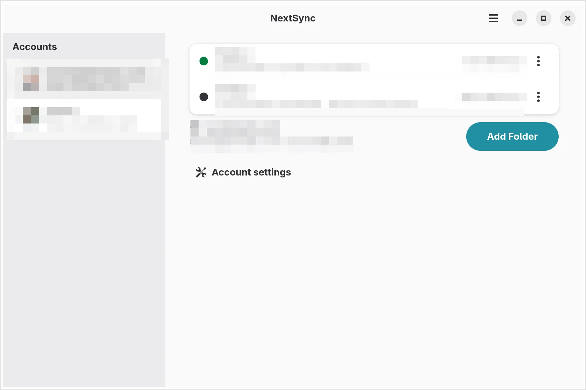

<div align="center">
  
  <h1>NextSync</h1>
  <p><strong>Your files, local.<br>Any server, in sync.</strong></p>
  <p>A GNOME desktop client that keeps a complete local mirror of your Nextcloud and OpenCloud accounts.<br>One small Rust binary. No telemetry, no subscriptions.</p>
  <p>
    <a href="https://nextsync.cloudless.club/">Website</a>
    ·
    <a href="https://github.com/gnacho/nextsync/releases">Releases</a>
    ·
    <a href="https://github.com/gnacho/nextsync/issues">Issues</a>
  </p>
  <p>
    <a href="README.md">English</a>
    ·
    <a href="README.es.md">Español</a>
  </p>
  <p>
    <a href="https://github.com/gnacho/nextsync/actions/workflows/ci.yml"></a>
    
    
  </p>
</div>

<p align="center">
  <picture>
    <source media="(prefers-color-scheme: dark)" srcset="landing/assets/shots/main-en-dark.webp">
    
  </picture>
</p>

## What it is

You keep your files on your disk. When your computer and your server need to agree on what changed, NextSync calls the official command line engine for your platform and wraps it in a real desktop experience: accounts, per-folder configuration, live progress, conflict resolution, and a tray icon that reflects what is actually going on.

It is deliberately boring engineering. The reconciliation logic stays in the official engines, which carry years of edge cases behind them. Everything NextSync adds is desktop glue: when to run, what to show, and what to do when something goes wrong.

## Why it exists

NextSync started as [nextsync-py](https://github.com/gnacho/nextsync-py), a small Python and GTK app that wrapped the official Nextcloud command line engine in a proper desktop experience. It worked well enough to run every day, but everything paid the Python tax: an interpreter to ship, a startup to wait for, and dynamic typing that turned GObject lifetime mistakes into runtime surprises instead of compiler errors.

The rewrite in Rust happened for practical reasons: several accounts and several providers in a single app, one small binary, and a codebase where async callbacks and GObject lifetimes cannot bite at runtime. The wrapper philosophy carried over intact and the desktop layer was rebuilt along the way.

## What it does

**Synchronization**

- Multiple accounts, and multiple folders per account, each mapped to its own remote path or OpenCloud space.
- Bidirectional reconciliation through the official engines, with delta transfers and conflicted copies.
- A remote poll that checks the folder ETag first and skips the scan when the server did not change. The ETag survives restarts.
- A scheduler that coalesces triggers into one queue, never runs two engines on the same folder, and never re-runs a folder because of its own sync events.

**Desktop**

- A libadwaita interface with per-folder status rows and file-by-file progress while a sync runs.
- A tray icon that reflects the global state (synced, syncing, paused, offline, needs attention) plus a menu to open the app or quit it. Closing the window keeps everything running.
- Conflict resolution from the app: keep local, keep remote, per file or in bulk.
- English and Spanish interface.

**Safety rails**

- Before a mass local deletion is propagated, sync stops and the review groups what disappeared by top-level folder, with expandable details. You approve once, restore from the server, or stay paused.
- If the server stops answering, the account goes offline instead of looping errors, and NextSync keeps probing until it is back.
- Rejected credentials pause automatic syncs for that account instead of hammering the server with retries. A locked keyring retries on its own with a capped backoff.

**Privacy**

- No telemetry, no analytics, no crash reporting. Nothing leaves your machine except sync traffic with your own server.
- Credentials live in the Secret Service (GNOME Keyring). Logs are local files, one per day.

## Providers

| Provider | Engine | Sign in |
|---|---|---|
| Nextcloud | `nextcloudcmd` | Login Flow v2 in your browser, or app password |
| OpenCloud | `opencloudcmd` | App password from the server web UI |

Both engines sit behind the same small trait, so a new provider is a command builder, not an architecture change. Server push notifications (`notify_push`) apply to Nextcloud; accounts without push fall back to a polling interval.

## Install

### Arch, CachyOS and derivatives

Download the `.pkg.tar.zst` from the [latest release](https://github.com/gnacho/nextsync/releases/latest) and install it:

```bash
sudo pacman -U nextsync-0.2.16-1-x86_64.pkg.tar.zst
```

The package depends on `gtk4` and `libadwaita`. For Nextcloud accounts install `nextcloud-client` (it provides `nextcloudcmd`); for OpenCloud accounts, the official `opencloudcmd`.

### From source

You need Rust (cargo) plus the GTK 4 and libadwaita development packages:

```bash
git clone https://github.com/gnacho/nextsync
cd nextsync
cargo build --release
```

The binary lands in `target/release/nextsync`. A `PKGBUILD` is included if you prefer to build the full package with `makepkg` on an Arch-like distribution.

## First run

1. Add an account: server address, then sign in with the browser (Nextcloud Login Flow v2) or an app password (OpenCloud).
2. Add folders: pick a local folder and where it maps on the server. For Nextcloud accounts the remote picker lists your existing folders; for OpenCloud you type the path.
3. If the local folder already had files or a previous synchronization, NextSync shows what is about to happen before it starts touching anything.
4. From there it syncs on changes, on schedule, and on server push events. Close the window; the tray keeps working.

## Deletions travel both ways

Sync mirrors deletions too. If a folder disappears locally, it disappears on the server, and the other way around. Keep an independent backup of anything important, and never point a second sync engine at the same local folder. The deletion review stops obvious disasters, but a review is not a backup.

## Files on disk

| What | Where |
|---|---|
| Configuration | `~/.config/nextsync/` |
| State, logs, avatars | `~/.local/state/nextsync/` |
| Credentials | GNOME Keyring (Secret Service) |

## Development

```bash
cargo test
cargo clippy --all-targets -- -D warnings
cargo fmt --check
```

The suite covers configuration, credentials, the scheduler, the sync engine, the push protocol, the deletion review, and the interface logic, with GTK smoke tests that tolerate headless environments. CI runs the same checks plus an i18n parity test that fails if any interface string lacks its Spanish translation, and a coverage job.

More in [CONTRIBUTING.md](CONTRIBUTING.md), [SECURITY.md](SECURITY.md) and the [CHANGELOG](CHANGELOG.md).

---

<p align="center"><sub>
Nextcloud is a registered trademark of Nextcloud GmbH. OpenCloud is a product of the Heinlein Group. NextSync is an independent, unofficial project and is not affiliated with, sponsored by, or endorsed by either company.
</sub></p>
