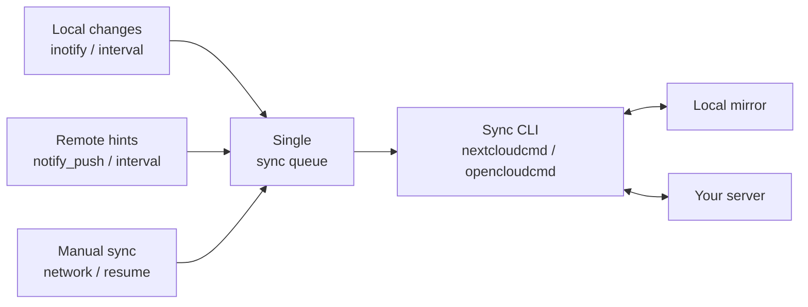

<div align="center">
  <h1>NextSync</h1>
  <p><strong>Your files, local. Any server, in sync.</strong></p>
  <p>A GNOME-native desktop companion for keeping complete local mirrors of your accounts. Server agnostic, built with Rust, GTK 4, and Libadwaita.</p>
  <p>
    <a href="https://github.com/gnacho/nextsync">Website</a>
    ·
    <a href="https://github.com/gnacho/nextsync/issues">Report an issue</a>
  </p>
  <p align="center">
    <a href="README.md">English</a> |
    <a href="README.es.md">Español</a>
  </p>
  <p>
    
    
    
    
    
    
  </p>
</div>

## A GNOME companion that does not care what server you run

NextSync is a GNOME desktop application that keeps one or more accounts mirrored to one or more local folders. It is **server agnostic by design**: it does not speak a vendor protocol, it delegates the synchronization itself to a command line sync tool, and it builds the desktop experience around that tool.

Today that means two providers:

- **Nextcloud**, through the official `nextcloudcmd` engine.
- **OpenCloud**, through the official `opencloudcmd` engine.

Any platform that ships a synchronization CLI can be added later behind the same abstraction. The desktop layer (accounts, credentials, scheduling, filesystem monitoring, tray, windows, logs, conflict resolution) stays the same; only the command builder changes.

The engine is the part that does the real work. NextSync is the part that makes it live nicely on the desktop: secure login, automatic triggers, a compact status window, GNOME integration, logs, and a tray menu.

### A fork, with thanks

NextSync inherits its identity and much of its design from [**PyNextCloud-Sync**](https://github.com/ehstbr/PyNextCloud-Sync) by **ehstbr**. That project is a beautiful piece of work, and every good decision it made about the desktop experience carried over here.

We took a different direction under the hood. PyNextCloud-Sync wraps one Nextcloud engine in Python and GTK 4 via PyGObject. NextSync is a Rust rewrite that generalizes the idea: instead of a companion for one specific Nextcloud account, it is a companion for **any sync tool** your server ships.

A big thank you to ehstbr for starting something so good, for making the right choices that we inherited, and for releasing it under the GPL-3.0-or-later license, which makes this project possible.

## Why a Rust rewrite

- **A single static binary.** No Python runtime, no site-packages layout. Distribution and autostart are trivial.
- **Small idle footprint.** A tray and windows companion sits far below the Python interpreter baseline, and startup is near instant.
- **Type safety across the app.** GObject lifetimes, async callbacks, and the state machine are exactly where Rust helps most.
- **Server agnostic by construction.** The sync engine is behind a small trait, so adding a third provider is a command builder, not an architecture change.

## Highlights

- **Multi-account.** Each account keeps its own synchronization and runtime settings.
- **Multi-folder.** Each account can mirror several local folders, each with its own remote path (or OpenCloud space), its own status, and its own triggers.
- **Multi-provider.** Nextcloud and OpenCloud today, anything with a sync CLI tomorrow, all in one app.
- **Built for large accounts.** No staging copies, no pre-transfer analysis. The engine's delta detection downloads only what differs.
- **Resources optimized, not duplicated.** All triggers funnel into a single coalescing queue per account, and the app never starts two sync processes for the same folder. A remote change and a local change arriving together produce one run, not two.
- **Official engine.** The CLI tool owns synchronization, conflict resolution, and safety. NextSync adds the desktop experience and the gaps the CLI leaves open.
- **GNOME-native interface.** Rust, GTK 4, and Libadwaita.
- **Secure credentials.** Stored through Secret Service / GNOME Keyring.
- **Fast local detection.** Recursive Linux `inotify` monitoring with event coalescing.
- **Tray menu.** Open, Settings, Log and Quit straight from the tray; closing the window keeps the app running in the background (the tray Quit item is the only way to fully exit).
- **Deletion guard.** A mass local deletion blocks sync before the engine can propagate it, because the CLI engines do not ask for confirmation in non-interactive mode.
- **Private by design.** No telemetry, no analytics, no remote crash reporting.

## How synchronization works

Every trigger asks the same scheduler for a bidirectional reconciliation. Requests that arrive together are coalesced into a single queue, and the app never intentionally starts two engine processes for the same account.



> [!IMPORTANT]
> Synchronization is bidirectional. Local and remote changes, including deletions, can be propagated to the other side. Keep an independent backup of important data and do not run another synchronization engine against the same local folder.

## Providers

| Provider | Engine | Authentication |
|---|---|---|
| Nextcloud | `nextcloudcmd` | Login Flow v2 (browser) or credentials via Secret Service |
| OpenCloud | `opencloudcmd` | App password created in the server web UI, stored in Secret Service |

Push notifications via `notify_push` apply to Nextcloud. OpenCloud has no `notify_push`, so that account relies on the remote interval trigger instead.

## Project status

This is an early development release. The architecture is in place: configuration, credentials, state machine, scheduler, sync engine with live progress, filesystem monitoring, deletion guard, and the provider abstraction. The GTK interface is being built next.

Test it with non-critical data before relying on it for regular synchronization, and always keep independent backups of important files.

## Development and tests

```bash
cargo check
cargo test
cargo clippy --all-targets -- -D warnings
```

The suite covers configuration, credentials, the state machine, the scheduler, the sync command builders for both providers, the live progress parser, filesystem monitoring, the deletion guard, and the notify_push protocol including a tolerant WebSocket handshake.

Real-account tests require an actual server and a desktop session and are marked `#[ignore]`.

## Documentation

- [Implementation plan](plans/2026-08-13-rust-rewrite.md)
- [GNU General Public License v3 or later](LICENSE)

---

<p align="center"><sub>
Nextcloud is a registered trademark of Nextcloud GmbH. OpenCloud is a product of the Heinlein Group. NextSync is an independent, unofficial project and is not affiliated with, sponsored by, endorsed by, or otherwise connected to either company. Use is subject to the GNU General Public License version 3 or later.
</sub></p>
